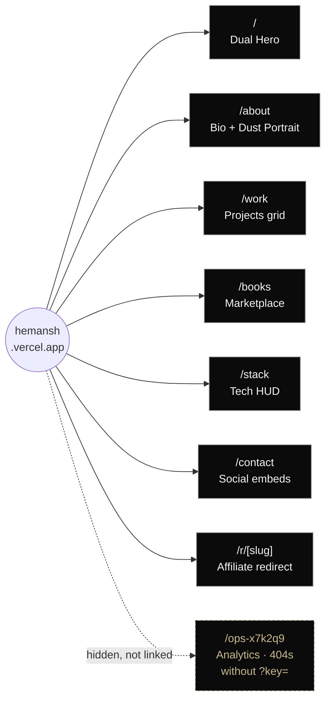
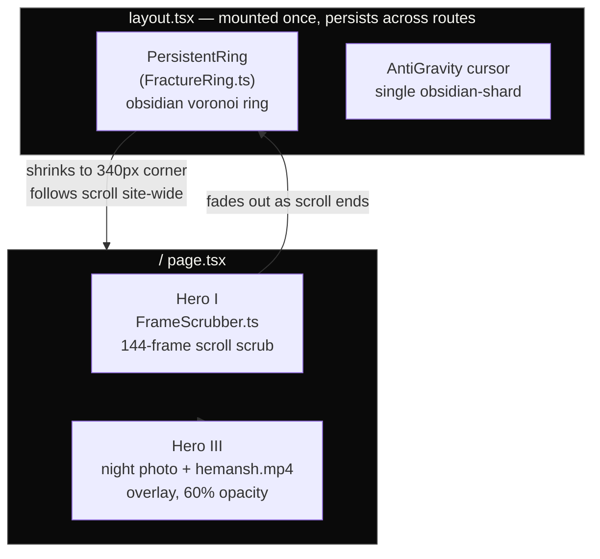
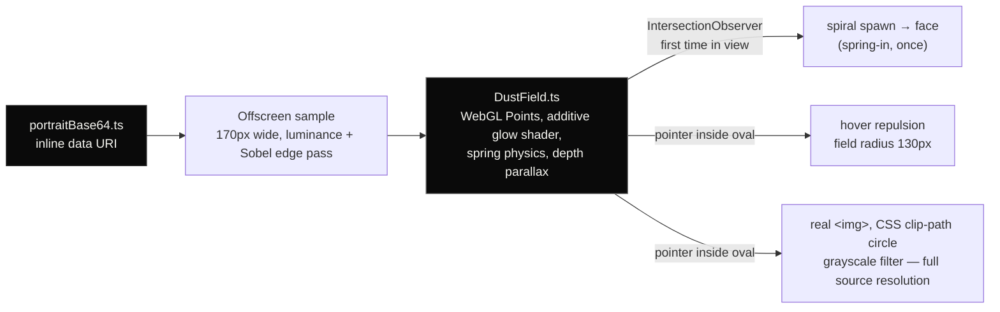
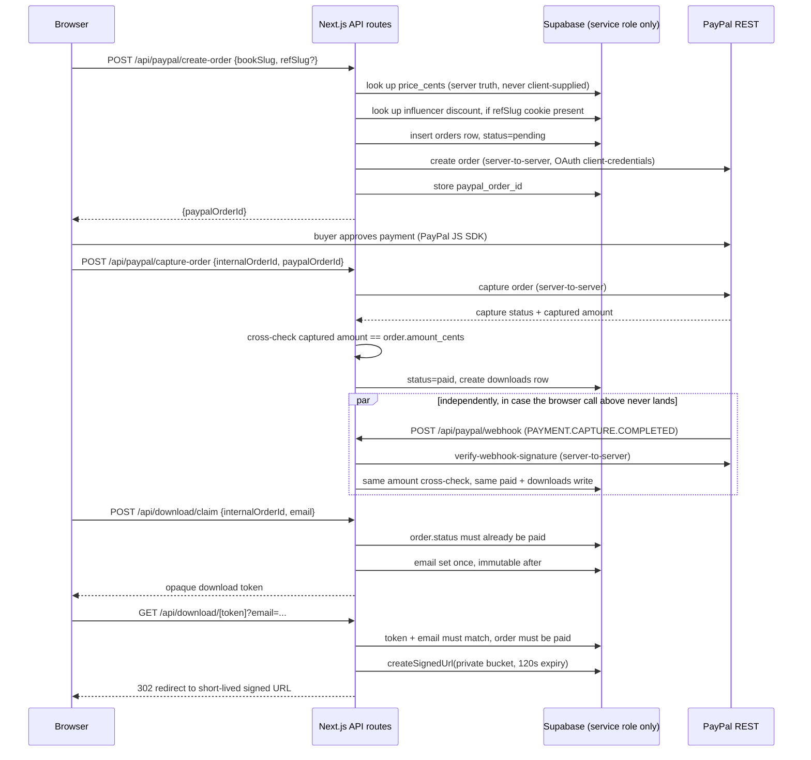

# HEMANSH.SYS — Architecture

Repo: `Hemansh-X797/Hemansh` · Deploy: `hemansh.vercel.app`
Stack: Next.js 14 (App Router, TS) · Tailwind · GSAP+ScrollTrigger+Flip · Anime.js · Three.js (vanilla, no R3F — matches the fracture-ring and dust-field source directly) · Lenis · Supabase (Postgres + Storage) · PayPal REST · Custom AntiGravity cursor engine.

The diagrams below are [Mermaid](https://mermaid.js.org) — GitHub, GitLab, Vercel's README preview, and most modern markdown viewers render these as real diagrams inline, not as code blocks. If your viewer doesn't support Mermaid, paste any block into https://mermaid.live to see it rendered.

## Design tokens
- `--bg: #030303` `--fg: #F5F5F0` `--line: rgba(255,255,255,0.08)`
- Radius: `0px` everywhere, no exceptions.
- Headers: Josefin Sans, uppercase, wide tracking, `.text-shine` animated black→silver→white gradient.
- Body: **Neue Montreal** — resolved (was open in the previous revision of this doc).
- Mono/HUD readout font for coordinates, percentiles, timestamps: **JetBrains Mono**.

## Site map



## Component / rendering layers (Home page)



## About page — dust field



## Marketplace — payment + delivery flow

The part of the system with real money and real security constraints. Two independent paths can mark an order `paid` (browser confirm *and* PayPal's own webhook) so a dropped connection on the buyer's side never loses a sale, and neither path trusts anything the client says about price.



## Folder structure (matches what's actually in the repo)

```
Hemansh/
├── public/
│   ├── sequence/frame_0001.jpg … frame_0144.jpg
│   ├── book_covers/            # empty — typographic placeholders still in use
│   ├── fonts/
│   └── og/
├── supabase/
│   └── schema.sql              # books, influencers, orders, downloads — RLS on, deny-by-default
├── src/
│   ├── app/
│   │   ├── layout.tsx           # metadata + JSON-LD graph + PersistentRing mount + Lenis
│   │   ├── page.tsx              # Home
│   │   ├── about/page.tsx
│   │   ├── work/page.tsx
│   │   ├── books/page.tsx
│   │   ├── stack/page.tsx
│   │   ├── contact/page.tsx
│   │   ├── r/[slug]/page.tsx     # affiliate redirect, sets `ref` cookie, → /books
│   │   ├── ops-x7k2q9/page.tsx   # hidden analytics — notFound() unless ?key=ANA_KEY matches
│   │   ├── api/
│   │   │   ├── paypal/create-order/route.ts
│   │   │   ├── paypal/capture-order/route.ts
│   │   │   ├── paypal/webhook/route.ts
│   │   │   ├── download/claim/route.ts
│   │   │   └── download/[token]/route.ts
│   │   ├── manifest.ts · sitemap.ts · robots.ts · globals.css
│   ├── components/
│   │   ├── canvas/
│   │   │   ├── FrameScrubber.ts        # preload + scrollTrigger scrub hook
│   │   │   ├── DualHeroCanvas.tsx      # state machine: scrubber → ring
│   │   │   ├── FractureRing.ts         # obsidian voronoi ring
│   │   │   ├── PersistentRing.tsx      # mounts FractureRing once, root layout
│   │   │   └── DustField.ts            # WebGL particle-field engine (about page)
│   │   ├── ui/
│   │   │   ├── DustPortrait.tsx        # wraps DustField + hover lens
│   │   │   ├── ProjectCard.tsx · SocialIconLink.tsx · HUDStat.tsx
│   │   ├── cursor/AntiGravityCursor.tsx
│   │   └── layout/Nav.tsx · Footer.tsx
│   ├── lib/
│   │   ├── server/
│   │   │   ├── supabaseAdmin.ts        # service-role client, `server-only` guarded
│   │   │   └── paypal.ts               # raw fetch against PayPal REST — no SDK license surface
│   │   ├── seo/                        # jsonld builders, per-page metadata factory
│   │   ├── data/                       # projects.ts, books.ts, stack.ts, quotes.ts, portraitBase64.ts
│   │   └── physics/antigravity.ts
│   └── hooks/                          # useLenis, useScrollProgress, useMagnetic
├── ARCHITECTURE.md
├── SETUP.md
└── README.md
```

## Data-driven content (no hardcoding in JSX)
Everything (projects, books, socials, stack, quotes) lives in `src/lib/data/*.ts` and both the UI **and** the JSON-LD graph read from the same source — so SEO claims never drift from what's on-page. Schema that contradicts visible content gets discounted by search engines and flagged as unreliable by AI crawlers.

## Security model (marketplace)
- **Price is server-side truth only.** The client sends a book slug, never an amount; every route re-derives `amount_cents` from `books.price_cents` in Supabase.
- **A sale is real only once PayPal itself confirms it**, checked two independent ways (see sequence diagram above): the server-initiated capture call, and a webhook whose signature is verified against PayPal directly via their own `verify-webhook-signature` endpoint — never a client-side "it worked" callback alone.
- **Book files are not in `/public`.** They live in a private Supabase Storage bucket; the only way out is a 120-second signed URL, generated server-side, only after a token+email pair is validated against a paid order.
- **Row Level Security is on for every table, zero policies for `anon`/`authenticated`** except one public SELECT on the book catalog. Only the service-role key — server env var only, imported through a file hard-guarded by Next.js's `server-only` package — can touch anything else.
- **The analytics dashboard 404s**, not "access denied," for anyone without the key, so an unauthenticated visit is indistinguishable from a route that was never built.

## SEO / AI-graph strategy
AI answer engines (Gemini/ChatGPT/Perplexity) don't read a `sameAs` field and just decide to praise you — they synthesize from what's actually crawlable and consistent across the web. What actually moves this:
1. **Consistent entity**: same name/bio/links repeated verbatim across the site, GitHub profile README, and LinkedIn headline. Alternate-name coverage belongs in visible text, not a meta-keywords array (Google has ignored meta keywords for ranking since ~2009).
2. **Structured data**: Person + WebSite + CreativeWork(s) + SoftwareApplication JSON-LD, cross-linked via `@id`.
3. **Depth pages**: `/about`, `/books`, `/work` each carry substantive real text (200+ words), not just cards — that's what LLMs actually pull sentences from.
4. **External corroboration**: GitHub READMEs and LinkedIn should echo the same achievements. AI engines cross-reference; a single glowing site with no external echo reads as low-confidence.

No fabricated stats, reviews, or achievements — single-source unverifiable claims are what actively backfires with AI answer engines. Real bio, real links, done rigorously, is the actual best-in-field version of this.

## Build phases
- **Phase 0**: metadata/layout.tsx, ARCHITECTURE.md, README.md — done.
- **Phase 1**: Data layer + Dual Hero (Frame Scrubber → Fracture Ring) + Cursor + Loader + Nav + Home page — done.
- **Phase 2**: About/Work/Books/Stack/Contact pages + dust-particle image effect — done; dust field rebuilt as a real WebGL particle system (see diagram above).
- **Phase 3**: Books → marketplace conversion — done. PayPal-only checkout, Supabase-backed, private-storage downloads, `/r/[slug]` affiliate attribution, hidden analytics.

## Still genuinely open (not fabricating an answer)
1. ~~Book covers: `public/book_covers/` is empty~~ — **fixed this pass.** All three books were missing real cover files (not just one, as a stale code comment implied), and the previous `<Image>` usage had no fallback, so it rendered a broken image icon live on `/books`. `BookPurchaseCard` now catches the load failure and swaps in `BookCoverFallback.tsx`, a real typographic cover built from the site's own tokens (Josefin Sans, hairline grid, "Cover pending" readout) instead of a broken-image box. Real cover art still needs to land in `public/book_covers/` — filenames already match what `books.ts` expects, so dropping files in replaces the fallback automatically, no code change needed.
2. ~~`/contact` — corrected, this doc previously overstated it~~ — **built for real this pass.** GitHub now renders as a genuine live card (`GithubCard.tsx`): avatar, name, bio, real repo/follower counts, fetched server-side from `api.github.com` (`lib/server/github.ts`), cached 1hr via Next's fetch `revalidate` so it doesn't burn the unauthenticated rate limit. If that fetch ever fails, it falls back to the plain icon link — never fabricated or stale numbers shown as if live. LinkedIn stays a plain icon link on purpose: LinkedIn has no public, keyless API for this, and faking a "live" card with static numbers would be exactly the kind of dishonest-looking real estate this doc argues against elsewhere. X/Instagram/Spotify/Discord unchanged.
3. "World population percentile" stat — searched the codebase; it does not exist anywhere in `/stack` or elsewhere. Confirmed nothing was fabricated. Still needs a real source before it ships, if it's wanted at all.
4. V.I.N.C.E. treatment — **confirmed correct, closing this one.** `projects.ts` has `status: 'private'`, and `ProjectCard.tsx` reads that to show a "Collaborators Only" badge, "Access Restricted" label, and no `href` at all — no repo link is rendered. Matches spec exactly.
5. Supabase project + PayPal live app: schema is written and routes are wired, but nothing goes live until the actual Supabase project and Vercel env vars (`PAYPAL_CLIENT_ID`, `PAYPAL_SECRET`, `PAYPAL_WEBHOOK_ID`, `SUPABASE_URL`, `SUPABASE_SERVICE_ROLE_KEY`, `DOWNLOAD_TOKEN_SECRET`, `ANA_KEY`) are actually set — see SETUP.md.
6. `public/fonts/` — resolved on your end; not a blocker.
